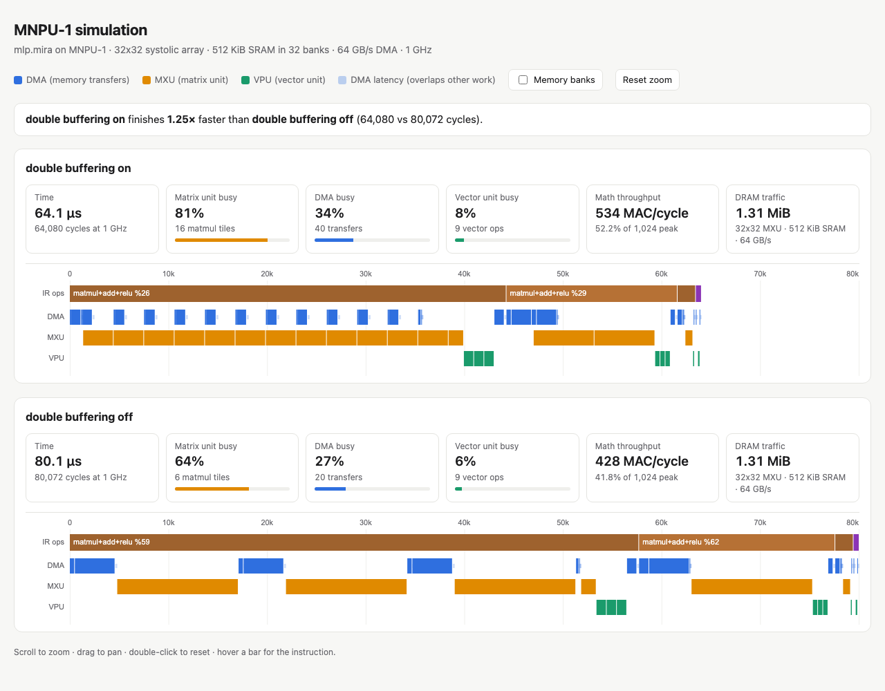

# MIRA

[](https://github.com/myramay/MIRA/actions/workflows/tests.yml)
[](https://myramay.github.io/MIRA/)

**MIRA is a programming language and compiler for running neural networks on neural processing units (NPUs)**,
the AI accelerators inside phones and laptops. One program compiles to Apple's Neural Engine, to standard MLIR,
and to a simulated NPU you can watch work instruction by instruction.

**[▶ Try the live simulator demo](https://myramay.github.io/MIRA/)** · [How it works](docs/HOW_IT_WORKS.md)



## Highlights

- **Runs real vision models on the Apple Neural Engine.** Torchvision's ResNet-18 and MobileNetV2, imported
  from ONNX, run entirely on the ANE (224×224, batch 1):

  | model | PyTorch on the CPU | MIRA on the ANE | with int8 weights |
  |---|---|---|---|
  | ResNet-18 | 7.70 ms | 1.39 ms (**5.6×**) | 1.16 ms |
  | MobileNetV2 | 16.59 ms | 0.48 ms (**35×**) | 0.40 ms |

  A 50M-parameter MLP runs in 8.6 ms on the ANE versus 82 ms in NumPy (9.6×). Per-op placement is reported
  from Core ML itself, and compiled models are cached on disk, so a second compile of ResNet-18 takes 0.5 s
  instead of 1.9 s.
- **Trains on the NPU.** `grad()` differentiates programs at compile time; the backward pass is ordinary IR, so it
  runs on every target. A training step is 3–4× faster with the Neural Engine enabled than on Core ML's CPU path.
- **Runs existing models.** PyTorch MLPs, CNNs and transformers import via ONNX and match PyTorch's output
  (to ~1e-7 on the CPU, within fp16 rounding on the accelerators).
- **A tiny GPT that learns to write.** [`examples/gpt_text.mira`](examples/gpt_text.mira) is a 2-layer
  character-level transformer. It trains on nursery rhymes in about 20 seconds (on the CPU, Core ML or MLIR, with
  fp16 loss scaling on the accelerators), then writes them out from a prompt, one character at a time, using a
  KV cache inside a `while` loop that compiles onto the device.
- **int8 math, not just int8 storage.** `quantize="w8a8"` calibrates activation scales and runs matmuls and
  convolutions as int8 × int8 → int32 on every target: Core ML's quantize/dequantize ops on the ANE, i8 `linalg`
  in MLIR, and an int8 mode of the simulated NPU's matrix unit (2× the multiplies per cycle).
- **A simulated NPU you can see inside.** MNPU-1 models banked SRAM, strided/transposing/int8 DMA, a 32×32
  systolic array and a cycle-level scoreboard; `mira emit … -s html` draws every instruction on an interactive
  timeline.
- **Found real bugs in Apple's and Google's compilers.** MIRA's fuzzer and tests caught Core ML computing an fp16
  constant-weight matmul followed by a transpose wrong, Core ML crashing Python by freeing NumPy buffers on a
  background thread, and IREE padding x86 max-reductions with 0 (so the max of negative numbers came out as 0),
  plus several other IREE wrong-result and compile-failure bugs. Each has a workaround and a regression test.
- **Tested hard.** About 410 tests, including random-program fuzzing across all backends, gradient checks
  against finite differences and PyTorch parity, run in CI on every push.

## Targets

| target    | what it is                                                                              |
|-----------|-----------------------------------------------------------------------------------------|
| `cpu`     | NumPy interpreter of the IR, used as the correctness reference ("golden model")          |
| `npu-sim` | MNPU-1, a simulated NPU: banked SRAM, strided/transposing/int8 DMA, a 32×32 systolic array, a cycle model |
| `coreml`  | Apple Neural Engine via Core ML (MIL), with per-op placement reporting                    |
| `mlir`    | Standard MLIR (linalg/tensor/scf) compiled by IREE to native CPU code (or the Mac GPU via Metal) |

Ops a target can't run fall back to the CPU automatically. A taste of the language, one SGD training step:

```mira
fn dense(x: f32[B, N], w: f32[N, M], b: f32[M]) -> f32[B, M] {
  return x @ w + b
}

fn main(x: f32[256, 64], labels: f32[256, 10], w: f32[64, 10], b: f32[10])
    -> (f32[], f32[64, 10], f32[10]) {
  let z = dense(x, w, b)
  let loss = -sum(labels * (z - log(sum(exp(z), axis=1, keepdims=true)))) / 256
  let gw, gb = grad(loss, [w, b])
  return loss, w - 0.5 * gw, b - 0.5 * gb       # one SGD step, compiled for the NPU
}
```

## See inside the NPU

`mira emit <program> -t sim -s html` runs a program on the simulated NPU and writes an interactive page:
every instruction on every engine, the IR op it belongs to, and (optionally) every on-chip memory bank.
Scroll to zoom, drag to pan, hover for details. `--compare` runs a variant side by side. Here, the same
MLP with and without double buffering: with it, memory transfers (blue) overlap the matrix unit (orange):

```bash
mira emit examples/mlp.mira -t sim -s html --compare no-double-buffer -o mlp.html && open mlp.html
mira emit examples/attention.mira -t sim -s html --compare mxu_dim=64     # a bigger matrix unit
```

## Setup

```bash
uv venv --python 3.12 .venv
uv pip install --python .venv/bin/python -e '.[coreml,mlir,onnx,dev]'
uv pip install --python .venv/bin/python -e '.[torch]'      # optional: to run the ONNX tests against PyTorch
source .venv/bin/activate
```

The `mlir` target's Metal GPU backend also needs Apple's Metal toolchain: `xcodebuild -downloadComponent MetalToolchain`.

## Use

```bash
mira run examples/mlp.mira -t coreml --check           # run on the Neural Engine, compare with CPU
mira run examples/cnn.mira -t sim --check --quantize int8
mira run examples/mlp.mira -t sim --quantize w8a8         # int8 weights *and* int8 math
mira run examples/attention.mira -t mlir --check
mira emit examples/mlp.mira -s tokens|ast|ir|opt|passes|partition|mlir
mira emit examples/mlp.mira -t sim -s asm              # MNPU-1 assembly
mira emit examples/mlp.mira -t sim -s timeline         # engine timeline + utilization
mira bench examples/bench/big_mlp.mira --targets cpu,mlir,coreml:cpu,coreml:ne
mira bench examples/bench/big_mlp.mira --targets npu-sim --sim-fast --sim mxu_dim=64
python examples/train.py --target coreml               # train an MLP on the Neural Engine
python examples/gpt_train.py --target coreml           # train a tiny GPT, then generate with a KV cache
python examples/gpt_text_train.py --target coreml      # train a character-level GPT on real text, then let it write
mira run model.onnx -t coreml --check                  # run an ONNX model (e.g. exported from PyTorch)
mira run model.onnx -t sim --shape x=4,3,224,224       # pin symbolic input dimensions
mira cache [--clear]                                   # the on-disk cache of compiled Core ML models
python -m pytest                                       # ~410 tests: fuzzing, gradient checks, PyTorch parity
```

From Python:

```python
import mira, numpy as np
prog = mira.compile_file("examples/mlp.mira", "coreml", weights={...}, quantize="int8")  # or "w8a8"
y = prog.run({"x": np.random.randn(64, 784).astype(np.float32)})
print(prog.placement_report())

# models exported from PyTorch / TensorFlow via ONNX
resnet = mira.compile_onnx("model.onnx", "coreml")          # symbolic batch dims compile per shape

# shapes known only at run time: compiled per shape, or per bucket with padding
dyn = mira.compile_source("fn main(x: f32[B, 16], const w: f32[16, 8]) -> f32[B, 8] {\n  return x @ w\n}\n",
                          "coreml", buckets={"B": [8, 32, 128]})
dyn.run({"x": np.ones((5, 16), np.float32)})     # runs the B=8 specialization, returns 5 rows
```

## Language

- Types: `f16[...]`, `f32[...]`, `i32[...]`. Dimensions are integers, shape symbols (`B`), or expressions (`H / 2`).
- Indexing like NumPy: `x[i]`, `x[:, 1:3]`, `x[-1]`, `emb[tokens]` (an `i32` tensor index is a gather), and
  indexed assignment `buf[t] = v` (a functional update, also at a runtime position `t`).
- Functions are generic over shape symbols and specialized per call. `int` parameters are compile-time integers.
  Functions can return several values: `-> (f32[], f32[4, 4])`, and `let a, b = f(x)` unpacks them.
- Statements: `let`, reassignment, `for i in 0..N` (unrolled), `if`/`else if`/`else`, `while`, `return a, b`.
  `if` and `while` on compile-time values are resolved by the compiler. On one-element tensors they become
  real control flow. The CPU drives it on `npu-sim`/`coreml`; on `mlir` it compiles onto the device as `scf.if`/`scf.while`.
- Operators: `+ - * / ** @` (NumPy broadcasting), comparisons `< <= > >= == !=` (give 1/0 masks on tensors).
  A line ending in a comma or an operator continues on the next line.
- Builtins: `relu gelu sigmoid tanh exp log sqrt abs sign erf maximum minimum matmul softmax sum mean max
  argmax argmin transpose reshape flatten broadcast slice pad concat where gather scatter_add dynamic_slice
  dynamic_update_slice conv2d maxpool2d avgpool2d layernorm cast size sort cumprod zeros ones full arange`.
  `conv2d` takes `stride`, `padding`, `dilation` and `groups`.
  and `grad(y, x)` / `grad(y, [x1, x2])` (reverse-mode autodiff, including higher-order).

## What each limitation became

| limitation | now |
|---|---|
| inference only | `grad` differentiates any program at compile time. The backward pass is ordinary IR, so training runs on every target (`examples/train.py`) |
| no data-dependent control flow | `if`/`while` on tensors: structured ops with sub-graphs, host-driven or compiled onto the device (MLIR) |
| no runtime shapes | unbound shape symbols give a `DynamicProgram` that specializes per shape, with optional bucketing and padding |
| no quantization | `quantize="int8"`: per-channel weight quantization. Core ML keeps weights compressed (1.8× faster on the ANE for big models); MNPU-1's DMA dequantizes on the fly. `quantize="w8a8"` also quantizes activations (calibrated) and does the multiplies in int8 on every target |
| simulator gaps | MNPU-1 now runs conv (implicit GEMM, grouped and dilated; depthwise on the vector unit), pooling, padding, any transpose, reductions, `where`, and int8 weights. It has a fast timing-only mode and configurable hardware (`--sim key=value`) |
| not MLIR | the `mlir` target emits upstream MLIR and compiles it with IREE. `mira emit -s mlir` prints it |
| Core ML placement is opaque | still decided by Core ML, but reported per op, and a warning is shown when Apple's ANE compiler rejects part of a model |
| can't load existing models | `mira.compile_onnx` / `mira run model.onnx`: ONNX import with import-time folding of shape arithmetic, grouped/depthwise/dilated convs, padded pooling, strided slices, and ONNX `If`/`Loop`. ResNet-18, MobileNetV2 and PyTorch transformers match PyTorch on every target |
| no integers or indexing | `i32` tensors, NumPy-style indexing, `gather`/`scatter_add`/`argmax`, all differentiable where it makes sense |
| no growing sequences | fixed-size buffers written at runtime positions (`dynamic_update_slice`, `buf[t] = v`). `examples/gpt_text.mira` trains a character-level GPT on real text and generates with a KV cache in a `while` loop |
| slow recompiles | compiled Core ML models are cached on disk, keyed by a hash of the program (`mira cache`, `MIRA_NO_CACHE=1`) |

Still true: the Neural Engine can only be reached through Core ML, which makes the final placement decisions; MNPU-1's
timing is a model of hardware that doesn't exist; and IREE's CPU code for large convolutions is slow (ResNet-18 takes
~400 ms on the `mlir` target versus 1.4 ms on the ANE), so for CNNs `coreml` is the target to use.

## Layout

```
mira/
  lexer.py  parser.py  syntax.py     front end: text -> tokens -> AST
  elaborate.py                       type/shape checking, specialization, inlining, control flow -> IR
  autodiff.py                        reverse-mode differentiation (one VJP rule per op)
  frontends/onnx_import.py           ONNX -> MIRA IR (NumPy evaluation of everything known at import time)
  ir.py  types.py  ops.py            the IR (with structured if/while), every op's shape rule and reference semantics
  passes.py  quantize.py             const-fold, simplify, CSE, DCE, epilogue fusion, fp16 lowering, int8 (W8 and W8A8)
  partition.py                       device placement, scheduling, cost model, segments
  compiler.py  cli.py                driver (incl. dynamic shapes) and command line
  backends/cpu.py                    golden model, fallback, host for control flow
  backends/coreml.py                 MIL emission, Neural Engine placement report, compiled-model cache
  backends/mlir.py                   MLIR emission (linalg/tensor/scf) + IREE compile & run
  backends/npusim/                   MNPU-1: codegen (tiling, memory planning, DMA) and machine
examples/                            MLP, CNN, transformer block, residual loop, fallback, training, tiny GPTs
tests/                               front end, passes, autodiff, control flow, indexing, ONNX, GPT, backends,
                                     simulator, fuzzing
```
