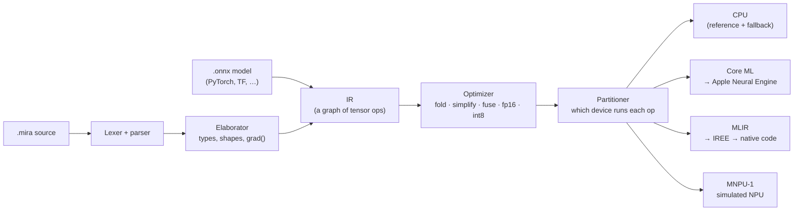

# How MIRA works

MIRA turns a short program describing a neural network into instructions for an AI chip. This page follows one
program through every stage, then explains the simulated chip, how the compiler is tested, and the bugs that
testing found. Everything shown is real output from `mira emit`.

## The problem

Phones and laptops now ship with **neural processing units (NPUs)**: chips built to do one thing very fast,
multiplying large grids of numbers. They are much faster and more power-efficient than a CPU at that job, but
they are picky:

- They want **fixed sizes**. Every tensor's shape must be known before the program runs.
- They compute in **low precision** (16-bit floats, or 8-bit integers).
- They have a **small, fast on-chip memory**. Data has to be moved in and out explicitly, in tiles that fit.
- They **can't run everything**. Anything unusual has to go back to the CPU.

A compiler bridges that gap: it takes a readable program and turns it into something the chip can run, deciding
along the way what goes where, in which order, and in what form.

## The pipeline



We'll follow this program, a tiny classifier layer:

```mira
fn main(x: f32[8, 16], const w: f32[16, 4], const b: f32[4]) -> f32[8, 4] {
  return softmax(relu(x @ w + b), axis=1)
}
```

`x` is the input (8 examples of 16 numbers each), `w` and `b` are trained weights (`const` means they are baked
into the compiled program), and `@` is matrix multiplication.

### 1. Reading the program: lexer and parser

The **lexer** splits the text into tokens (`fn`, `main`, `(`, `x`, `:`, `f32`, …). The **parser** arranges
them into a tree that reflects the program's structure, so that `relu(x @ w + b)` means "relu of (the product
plus b)", not anything else. Mistakes are caught here with an arrow pointing at the problem.

### 2. Checking it: the elaborator

The **elaborator** works out the shape of every value and checks they fit together. Multiplying `f32[8, 16]` by
`f32[16, 4]` gives `f32[8, 4]`. Multiplying by `f32[15, 4]` is an error, reported before anything runs:

```
error: matmul: inner dimensions don't match: f32[8, 16] @ f32[15, 4] (16 != 15)
```

It also expands helper functions in place, unrolls compile-time loops, and handles `grad()`: automatic
differentiation, which writes the extra operations needed for training. The result is the **IR**
(intermediate representation), a flat list of tensor operations:

```
graph main(%x: f32[8, 16]) -> (f32[8, 4]) {
  %2 = const() {value=<f32[16, 4]>}                            : f32[16, 4]
  %3 = const() {value=[1.0329,0.9741,1.1583,1.132 ]}           : f32[4]
  %4 = matmul(%x, %2)                                          : f32[8, 4]
  %5 = add(%4, %3)                                             : f32[8, 4]
  %6 = relu(%5)                                                : f32[8, 4]
  %7 = softmax(%6) {axis=1}                                    : f32[8, 4]
  return %7
}
```

ONNX models (exported from PyTorch and others) enter the pipeline here: the importer builds this same IR
directly, so everything after this point is shared.

### 3. Improving it: the optimizer

The optimizer rewrites the IR into an equivalent, faster form: precomputing anything that depends only on
weights, removing duplicated or unused work, and, most importantly, **fusion**:

```
  %6 = matmul(%x, %2, %3) {epilogue=[add(in2) -> relu]}        : f32[8, 4]
  %7 = softmax(%6) {axis=1}                                    : f32[8, 4]
```

The bias add and the relu are now an *epilogue* of the matmul. On an NPU this means the intermediate result
never leaves the chip: it gets the bias and relu while it's still in the fast on-chip memory, instead of being
written out to main memory and read back twice. For accelerator targets the optimizer also switches to 16-bit
floats, and can optionally use 8-bit integers in one of two ways:

- **int8 weights** (`quantize="int8"`): weights are stored as small integers plus one scale per output channel,
  which halves the memory they take. The math is still done in 16-bit floats.
- **int8 math** (`quantize="w8a8"`): the inputs to each matmul and convolution are rounded to integers too.
  MIRA runs the program on a few sample inputs to learn how large each layer's values get (*calibration*), and
  picks a scale so they fit between −127 and 127. Then the chip multiplies small integers, which is cheaper than
  multiplying floats, and converts the sums back to real numbers at the end.

### 4. Deciding where things run: the partitioner

Each target can run some operations and not others. The partitioner asks the target about every op, groups ops
into **segments** per device, and inserts the hand-offs between them. Here, on the simulated NPU:

```
  %8  = cast(%x) {dtype=f16}                              @cpu  (MNPU-1 only computes in fp16)
  %13 = matmul(%8, %9, %10) {epilogue=[add(in2) -> relu]} @npu-sim
  %14 = softmax(%13) {axis=1}                             @npu-sim
  %15 = cast(%14) {dtype=f32}                             @cpu
```

A small cost model also keeps tiny segments on the CPU when moving the data would cost more than it saves. This
fallback is what lets *any* program run on an NPU target: the chip does what it can, the CPU does the rest.

### 5. Making instructions: the backends

Each target gets the IR in its own form:

- **CPU** runs every op with NumPy. It is the *reference*: every other backend is tested against it.
- **Core ML** receives the program in MIL, Apple's own format; Core ML then decides which ops run on the Neural
  Engine (MIRA reports where each one landed).
- **MLIR** is the industry-standard compiler framework. MIRA writes standard MLIR, and
  [IREE](https://iree.dev) compiles it to native code. Loops and branches compile onto the device here.
- **MNPU-1** is a simulated NPU, and the one where you can see everything. Its code generator emits
  instructions like these:

```
; matmul %13: M=8 K=16 N=4 x1 -> tiles tm=8 tk=16 tn=4, epilogue ['add', 'relu']
    0  dma.load    sram[0x00000](8x16) <- t8[0:8, 0:16]                        ; A tile (0,0) slot 0
    1  dma.load    sram[0x04000](16x4) <- t9[0:16, 0:4]                        ; B tile (0,0) slot 0
    2  mxu.matmul  acc[0x00000](8x4) = sram[0x00000](8x16) @ sram[0x04000](16x4)
    3  dma.load    sram[0x08000](1x4) <- t10[0:1, 0:4]                         ; epilogue operand (row)
    4  vpu.add     acc[0x00000](8x4) <- acc[0x00000](8x4), sram[0x08000](1x4).row
    5  vpu.relu    acc[0x00000](8x4) <- acc[0x00000](8x4)
    6  vpu.copy    sram[0x0c000](8x4) <- acc[0x00000](8x4)                     ; writeback fp32 -> fp16
    7  dma.store   t13[0:8, 0:4] <- sram[0x0c000](8x4)
```

Load the inputs, multiply, add the bias and apply relu in place, convert to 16-bit, store. That is the
fused epilogue from step 3, as hardware instructions.

## Inside the simulated NPU

MNPU-1 is modeled on real NPU designs, simplified enough to read in one sitting. It has three engines that run
at the same time:

| engine | job |
|---|---|
| **DMA** | moves data between main memory (big, slow) and on-chip SRAM (512 KiB, fast, 32 banks) |
| **MXU** | a 32×32 *systolic array*: 1,024 multiply-adds per cycle, the chip's main muscle |
| **VPU** | a 32-lane vector unit for everything else: bias adds, activations, softmax, layernorm |

Big matrix multiplies don't fit on-chip, so the code generator splits them into **tiles**, choosing tile sizes
that fit in SRAM while minimizing traffic to main memory. It allocates on-chip buffers and uses **double
buffering**: while the MXU works on tile *i*, the DMA engine is already loading tile *i+1* into a second buffer.
A hardware *scoreboard* makes each instruction wait only for the data it actually needs, so the engines overlap
whenever they can.

The simulator executes the instructions for real (the numbers it produces are checked against the CPU) and
counts cycles. `mira emit program.mira -t sim -s html` turns a run into an
[interactive timeline](https://myramay.github.io/MIRA/), where you can see the overlap directly: with double
buffering, memory transfers sit underneath the matrix work; without it, they take turns and the run is 1.25×
slower.

## How it's tested

A compiler that produces wrong numbers is worse than no compiler, so most of the effort went into checking it:

- **Differential testing.** Every example runs on every target and is compared with the CPU reference.
- **Fuzzing.** Random, valid programs are generated and checked on every target, catching combinations no one
  would think to write by hand.
- **Gradient checks.** Every differentiable operation's `grad()` is compared against finite differences.
- **PyTorch parity.** PyTorch models are exported to ONNX, run through MIRA, and compared with PyTorch itself.
- **Crash and regression tests** for every bug found, and **CI** that runs the suite on Linux x86 on every push.

## Bugs found along the way

The tests didn't only find bugs in MIRA. Several were in the tools MIRA builds on:

| where | what happened | MIRA's workaround |
|---|---|---|
| Apple Core ML | an fp16 matmul with constant weights, followed directly by a transpose, gave wrong numbers | emit it as Core ML's `linear` op instead |
| Apple Core ML | a few seconds after a prediction, Core ML freed NumPy input buffers on its own thread without Python's lock, crashing the interpreter | keep references to recent inputs so Core ML never frees the last one |
| Apple ANE compiler | quietly rejects parts of some models, which then run on the CPU while Core ML's report still says "Neural Engine" | capture the compiler's log and warn in the summary |
| Google IREE (x86) | max/min reductions padded leftover vector lanes with 0, so the max of all-negative numbers came out as 0 | pad the data with −∞/+∞ before reducing |
| Google IREE | scalar inputs arrived as 0; `concat` → `extract` → `slice` gave wrong results; 0-d gathers, i32 min-reductions and some fp16 convolutions failed to compile | reshape scalars at the boundary, build small vectors element by element, use slices and fp32 where needed |

## Honest limits

- The Neural Engine is only reachable through Core ML, which makes the final decision about what runs on it.
- MNPU-1's timing is a model of a chip that doesn't exist, not a measurement.
- IREE's CPU code for large convolutions is slow: ResNet-18 takes about 400 ms on the `mlir` target, versus
  1.4 ms on the Neural Engine. For CNNs, use `coreml`.
- The ONNX importer covers the layers in common vision models and transformers (including grouped and depthwise
  convolutions and ONNX's `If`/`Loop`), but not every one of ONNX's ~190 operators.
- There is no backend for AMD's or Intel's laptop NPUs yet. Their compilers (AMD's Ryzen AI / IREE-AMD-AIE, Intel's
  OpenVINO) only run on Windows or Linux machines that have those chips.

## Where to look in the code

| stage | file |
|---|---|
| lexer, parser, syntax tree | [`mira/lexer.py`](../mira/lexer.py), [`mira/parser.py`](../mira/parser.py), [`mira/syntax.py`](../mira/syntax.py) |
| checking, shapes, control flow | [`mira/elaborate.py`](../mira/elaborate.py) |
| automatic differentiation | [`mira/autodiff.py`](../mira/autodiff.py) |
| the IR and every op's meaning | [`mira/ir.py`](../mira/ir.py), [`mira/ops.py`](../mira/ops.py) |
| optimizer, quantization | [`mira/passes.py`](../mira/passes.py), [`mira/quantize.py`](../mira/quantize.py) |
| partitioner | [`mira/partition.py`](../mira/partition.py) |
| ONNX import | [`mira/frontends/onnx_import.py`](../mira/frontends/onnx_import.py) |
| backends | [`mira/backends/`](../mira/backends/) (`cpu.py`, `coreml.py`, `mlir.py`, `npusim/`) |
